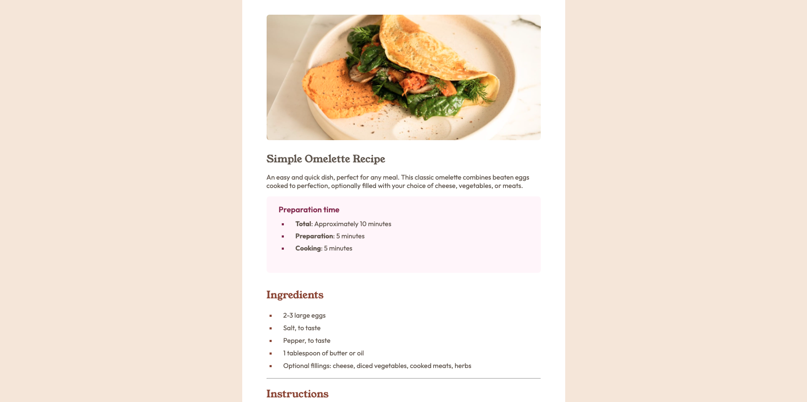
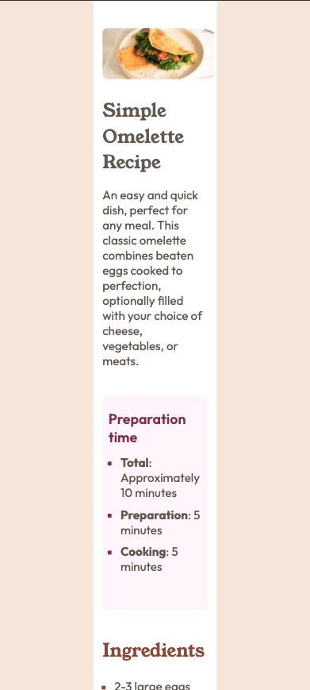

# Frontend Mentor - Recipe page solution

This is a solution to the [Recipe page challenge on Frontend Mentor](https://www.frontendmentor.io/challenges/recipe-page-KiTsR8QQKm). Frontend Mentor challenges help you improve your coding skills by building realistic projects. 

## Table of contents

- [Overview](#overview)
  - [The challenge](#the-challenge)
  - [Screenshot](#screenshot)
  - [Links](#links)
- [My process](#my-process)
  - [Built with](#built-with)
  - [What I learned](#what-i-learned)
  - [Continued development](#continued-development)
  - [Useful resources](#useful-resources)
- [Author](#author)

## Overview

### Screenshot
***Desktop***

***Mobile***

### Links

- Solution URL: [Solution URL here](https://github.com/ownedbyanonymous/recipe-page-main)
- Live Site URL: [Live site URL here](https://recipe-page-main-ka9w.vercel.app/)

## My process

### Built with

- Semantic HTML5 markup
- CSS
- Flexbox
- Desktop-first workflow

### What I learned

I encountered a challenge of the content overflowing on mobile devices, this forced me to revisit the Flexbox topic. Also l realised why it is important to develop for mobile devices first before developing/ designing for larger screens.

### Continued development

Adhering to best practices like developing for mobile devices is still a challenge
Knowledge gaps in the use of media queries for resposniveness

### Useful resources

- [Resource 1](https://developer.mozilla.org/en-US/docs/Web/CSS/CSS_flexible_box_layout/Basic_concepts_of_flexbox#the_flex_container) - This resource was helpful in fundamental information about Flexbox

## Author

- Frontend Mentor - [@ownedbyanonymous](https://www.frontendmentor.io/profile/ownedbyanonymous)

